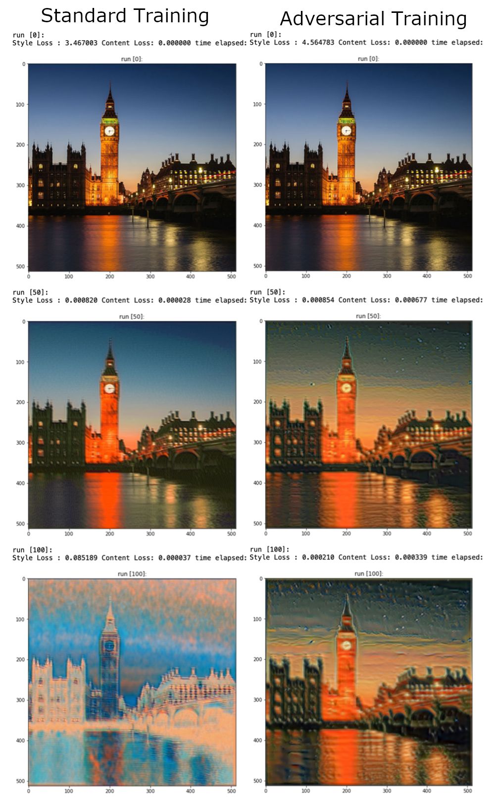

# What is this
This repo presents a new take on the paper "A Neural Algorithm of Artistic Style" by Leon A. Gatys, Alexander S. Ecker and Matthias Bethge. At the time their results were quite groundbreaking, though by now have long been surpassed by other algorithms such as GANs (see https://junyanz.github.io/CycleGAN/). 

That being said, I wanted to take another look at the seemingly elegant way that style transfer was done in Leon et al's paper, and see if I could make some (albeit marginal) improvement. 

My research led me to this experiment [https://distill.pub/2019/advex-bugs-discussion/response-4/] by Reiichiro Nakano. There, he saw that when comparing the results of style transfer of a normally trained resnet-50 vs a robustly trained resnet-50, the robustly trained one had much better results.

Another known fact is that nobody has actually beaten the VGG architechture when using this technique for style transfer. So I hypothesized that robustly training a VGG model will produce even better results than the original paper.

Unfortunately, I dont have the necessary compute to reproduce the original paper, but my toy example seems like we may be onto something.

In the image above you can see the results of style transfer after training `n` epochs on cifar (both in a standard fashion and in an adversarial fashion). The adversarial case not only captures style information faster, but doesnt fall apart by the last experiment.

There are a lot of reasons as to why this could be (is adversarial training effectively training more, ...?) But this is the best I could do with my time :).

The conclusion is that I think there is more to investigate here, both in the small field of style transfer but also in the general way of deep learning. These deeper and deeper models are less and less naturally robust. Im not sure if we should be going in the direction of highest imagenet accuracy at any cost. There should be more research done on why exactly VGG is so naturally robust, maybe there is more to learn here?

Feel free to look at `report.pdf` for a deeper dive (but there is a lot of crap there that I just left for school).

-------------------------------

**Reproducing the VGG models (robust & non-robust):**

Note: you will need a nvidia gpu to reproduce these models.

First, you must download the CIFAR10 dataset yourself (cant fit it in the submission). Download it from here: https://www.cs.toronto.edu/~kriz/cifar.html.

Next, you can train the models with the robustness lib from command line. 

To train the non-robust version use this command: `python -m robustness.main --dataset cifar --data /path/to/cifar \
   --adv-train 0 --arch vgg19 --out-dir /logs/checkpoints/dir/`

For the robust version specify `--adv-train 1` instead of `0`. Also you must supply these flags: `--constraint 2`, `--eps 0.5`, `--attack_lr 1.5`, `--attack_steps 20`.

Copy the checkpoint.pt.best of each to the /src/models/ folder and place the robust model in /robust/ and the non-robust model in /non_robust/, respectively.

-------------------------------

**Dependencies:**

PIL

matplotlib

pytorch & torchvision

robustness [https://github.com/MadryLab/robustness]